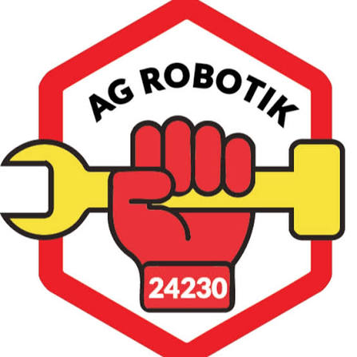

# Lingo – Türkçe Kelime Oyunu

<p align="center"></p>
<p align="center"><b>Bu proje FTC #24230 AG Robotik takımı tarafından yapılmıştır.</b></p>

TRT 1'de yayınlanan **Lingo Türkiye** yarışmasının (ve Hollanda orijinalinin) kurallarıyla tarayıcıda oynanan, bağımlılıksız bir kelime oyunu. İlk harfi verilen kelimeyi 5 tahminde bul, top çek, LINGO yap.

- Saf HTML / CSS / JavaScript – derleme adımı yok, `index.html` açmak yeterli.
- Türkçe harf desteği (İ/ı, Ğ, Ş, Ç, Ö, Ü) ve ekran klavyesi; fiziksel klavye de çalışır.
- Üç mod: **Tek Oyuncu**, **İki Takım** (aynı cihazda sırayla), **Günün Kelimesi** (herkes için aynı kelime, paylaşılabilir sonuç).

## Nasıl oynanır?

1. Kelimenin **ilk harfi** verilir. Aynı uzunlukta, aynı harfle başlayan bir kelime yazıp ENTER'a bas. Sözlük kontrolü yapılmaz; her harf dizisi tahmin olarak kabul edilir.
2. Her tahminden sonra harfler işaretlenir:
   - 🟥 **Kırmızı kare**: harf doğru ve doğru yerde. Bir sonraki satıra ipucu olarak taşınır.
   - 🟡 **Sarı daire**: harf kelimede var ama yanlış yerde.
   - ⬜ Gri: harf kelimede yok.
3. Toplam **5 tahmin** hakkın var. Her tahmin için süre sınırı vardır; süre dolarsa o hak yanar.
4. Kelimeyi bulunca torbadan **2 top** çekersin:
   - Numaralı top → Lingo kartındaki sayıyı işaretler.
   - Yeşil top → bir top daha çekersin.
   - Kırmızı top → çekiliş biter.
   - `?` topu → karttan istediğin sayıyı seçersin.
5. Kartta yatay, dikey veya çapraz 5 sayı tamamlanınca **LINGO!** (+500 puan ve yeni kart).

**Puan:** harf sayısı × 20 × (6 − deneme sırası). 5 harfli kelimeyi ilk denemede bulmak 500, beşinci denemede bulmak 100 puan.

**İki takım modunda** yanlış tahmin veya süre aşımında sıra rakibe geçer. Yönetim panelinden **bonus harf** açılırsa sıra geçince rakibe kelimeden rastgele bir harf gösterilir (TV kuralı; varsayılan kapalı). Kelimeyi bulan takım puanı alır ve kendi kartı için top çeker. Takımlardan biri çift, diğeri tek sayılı kart kullanır.

## Ayarlar

| Ayar | Nerede | Açıklama |
|------|--------|----------|
| Harf sayısı (4–7) | Ana menü | Yarışmadaki 4/5/6 harfli etaplar ve 7 harfli "Süper Lingo" |
| Tahmin süresi (0–60 sn) | Ana menü | 0 = süresiz |
| Kelime sayısı (3/5/10) | Ana menü | Bir oyundaki kelime sayısı |
| Renk teması | ⚙ Ayarlar | TV (kırmızı kare / sarı daire) veya Wordle (yeşil / sarı) |

İstatistikler (oyun, kelime, başarı yüzdesi, deneme dağılımı, LINGO sayısı, günlük seri) tarayıcının `localStorage` alanında tutulur.

## Çalıştırma

Oyun üç şekilde çalışır. En kolayı **yalnızca GitHub** kullanmaktır.

### 1. Yalnızca GitHub (GitHub Pages) – önerilen

Sunucu gerekmez. Kelimeler depodaki `kelimeler.json`, ayarlar `ayarlar.json` dosyasında durur; oyun bu dosyaları doğrudan okur.

1. Depoda **Settings → Pages → Build and deployment → Source: Deploy from a branch**, dal `main`, klasör `/ (root)` seçin. Oyun `https://<kullanıcı>.github.io/lingo/` adresinde yayınlanır.
2. Kelime eklemenin iki yolu vardır:
   - **Yönetim paneli:** `https://<kullanıcı>.github.io/lingo/admin.html` sayfasını açın, GitHub erişim token'ı ile bağlanın; ekleme, silme ve ayar değişiklikleri depoya commit olarak yazılır. GitHub Pages 1–2 dakika içinde güncellenir.
   - **Doğrudan düzenleme:** GitHub'da `kelimeler.json` dosyasını açıp kalem simgesiyle düzenleyin ve commit edin. Kelimeler küçük harfle, ilgili uzunluğun listesine yazılır.
3. Bonus harf kuralı için `ayarlar.json` içindeki `bonusLetter` değerini panelden ya da elle `true` / `false` yapın.

**Token nasıl alınır?** GitHub'da **Settings → Developer settings → Personal access tokens → Fine-grained tokens → Generate new token**. *Repository access* için yalnızca bu depoyu seçin; *Permissions → Repository permissions → Contents* için "Read and write" verin. Başka izin gerekmez. Token yalnızca sekme açıkken tarayıcıda tutulur; kimseyle paylaşmayın, süresi dolunca yenisini alın.

### 2. Yerel dosya

`index.html` dosyasını çift tıklayarak açmak yeterlidir; kelime havuzu `js/words.js` içindeki gömülü listeden gelir. Yönetim paneli bu modda çalışmaz.

### 3. Node.js sunucusu (isteğe bağlı)

Bağımlılıksız `server.js` statik dosyaları sunar, kelime havuzunu `data/words.json` dosyasında tutar ve şifre korumalı bir API sağlar. Oyun açılışta `api/words` uç noktasını bulursa havuzu sunucudan alır; günün kelimesini de herkes için aynı olacak şekilde sunucu belirler.

```bash
# macOS / Linux
ADMIN_PASSWORD='gizli-şifre' npm start     # http://localhost:8080

# Windows PowerShell
$env:ADMIN_PASSWORD = "gizli-şifre"; npm start

# Windows komut istemi (cmd)
set ADMIN_PASSWORD=gizli-şifre && npm start

# Yönetim paneli: http://localhost:8080/admin.html
```

| Ortam değişkeni | Varsayılan | Açıklama |
|-----------------|------------|----------|
| `PORT` | `8080` | Dinlenecek port |
| `ADMIN_PASSWORD` | boş | Yönetim şifresi. Boşsa panel yalnızca listeler; ekleme/silme kapalıdır. |
| `DATA_DIR` | `./data` | `words.json`, `daily.json` ve `settings.json` klasörü. İlk çalıştırmada `kelimeler.json` ile doldurulur. |

Render, Railway veya Fly.io gibi bir serviste yayınlarken start komutu `node server.js`, şifre ise ortam değişkeni `ADMIN_PASSWORD` olarak girilir.

### Yönetim paneli (`admin.html`)

Panel hangi ortamda olduğunu kendisi anlar: Node sunucusu varsa şifreyle, yoksa GitHub token'ı ile bağlanır.

- **Oyun ayarları:** Herkes için geçerli kurallar. Şimdilik tek ayar var: *Bonus harf* (iki takım modunda sıra geçince rakibe harf açılır). Varsayılan kapalı.
- **Kelime ekle:** Tek tek ya da toplu yapıştırarak; virgül, boşluk veya satır sonuyla ayrılmış. Kelimeler Türkçe küçük harfe çevrilir; 4–7 harf ve Türk alfabesi dışındakiler nedeniyle birlikte reddedilir, tekrarlar atlanır.
- **Kelime havuzu:** Uzunluğa göre sekmeler, arama, tek tıkla silme, JSON indirme.

### API (yalnızca Node sunucusu)

| Yöntem | Yol | Yetki | Açıklama |
|--------|-----|-------|----------|
| GET | `/api/health` | – | Durum, kelime sayıları, yönetimin açık olup olmadığı |
| GET | `/api/words` | – | Tüm havuz (`?len=5` ile tek uzunluk) |
| GET | `/api/daily` | – | Günün 5 harfli kelimesi (gün boyunca sabit) |
| GET | `/api/settings` | – | Oyun ayarları (`{ "bonusLetter": false }`) |
| PUT | `/api/settings` | şifre | Ayar değiştirme, ör. `{ "bonusLetter": true }` |
| POST | `/api/auth` | – | `{ "password": "…" }` ile şifre doğrulama |
| POST | `/api/words` | şifre | `{ "text": "kalem, defter" }` veya `{ "words": ["kalem"] }` ile ekleme; `added / skipped / rejected` döner |
| DELETE | `/api/words/:kelime` | şifre | Kelime silme |

Yetki gerektiren isteklerde şifre `x-admin-key` başlığında (URI kodlanmış) ya da `Authorization: Bearer …` olarak gönderilir.

## Test

```bash
npm test
```

`test/logic.test.js` çekirdek kuralları (harf değerlendirme, tekrar eden harfler, Türkçe büyük/küçük harf, kelime doğrulama, Lingo kartı ve top havuzu, puanlama) ve kelime havuzunun tutarlılığını sınar. `test/github-store.test.js` GitHub API istemcisini sahte bir API ile (okuma, yazma, çakışmada yeniden deneme, UTF-8) sınar. `test/server.test.js` Node arka ucunu geçici bir veri klasörüyle ayağa kaldırıp API'yi sınar.

## Proje yapısı

```
index.html          Oyun sayfası
admin.html          Kelime yönetim paneli (GitHub token'ı ya da Node sunucusu şifresiyle)
kelimeler.json      Kelime havuzu (GitHub Pages modunun veri dosyası; elle de düzenlenebilir)
ayarlar.json        Oyun ayarları (bonusLetter)
js/logic.js         Saf oyun mantığı + kelime deposu yardımcıları (DOM'suz; sunucu ve testler de kullanır)
js/game.js          Oyun akışı, süre, sıra geçişi, kart/top çekme, arayüz
js/admin.js         Yönetim paneli (ortamı algılar: GitHub / sunucu)
js/github-store.js  GitHub Contents API istemcisi (JSON dosyalarını okur, commit atarak yazar)
js/words.js         Gömülü kelime listesi (yerel dosya kullanımı için yedek)
css/style.css       Stil, TV / Wordle temaları, duyarlı düzen
server.js           İsteğe bağlı Node.js arka ucu
assets/             Takım logosu
data/               Node sunucusunun yazdığı dosyalar (git dışı)
test/               Node yerleşik test çalıştırıcısı ile birim ve API testleri
docs/arastirma.md   Lingo kuralları ve örnek uygulamalar araştırma notları
```

## Kelime havuzu

Havuz yalnızca cevap kelimesi seçiminde kullanılır; tahminler sözlükle karşılaştırılmaz. Oyun havuzu şu sırayla arar: Node sunucusu (`api/words`) → depodaki `kelimeler.json` → gömülü `js/words.js`.

Kelime eklemek için `admin.html` panelini kullanın ya da `kelimeler.json` dosyasını doğrudan düzenleyin. `npm test` dosyanın tutarlılığını (uzunluk, alfabe, tekrar) denetler.
